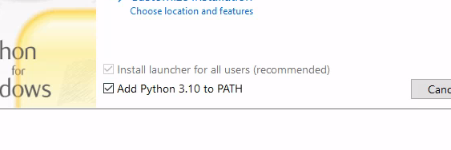
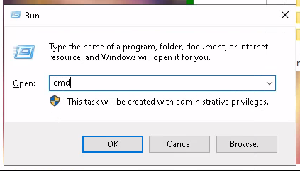

# Screenshot Bot:

Este bot tem o seu código aberto, de forma que qualquer pessoa pode vê-lo, fazer uma fork, ou updates.

Desenvolvi esse bot inicialmente para o meu uso pessoal porque queria acessar um livro de maneira offline em PDF.

Somente mudei a forma de acesso do conteúdo, em nenhum momento eu piraterei, distribui ou comercializei o conteúdo.


# Instalação:

### Baixe e instale o Python pelo [site](https://www.python.org/downloads/) ou pela [windows store](https://www.microsoft.com/p/python-37/9nj46sx7x90p?activetab=pivot:overviewtab).

Se você baixar pelo site é importante marcar a opção para adicionar o
python ao PATH:


### Realize o download do codigo no formato zip, e extraia o arquivo.

### Copie o caminho até a pasta do bot:


### Abra o terminal.

Aperte a tecla do windows + r e digite "cmd":



### Navegue até a pasta do bot:
Digite o comando "cd" + caminho que você copiou:


### Instale as dependências:

```
pip install -r requirements.txt
```

  


### Faça as configurações para o seu caso de uso

Primeiro tire um print do botão que muda a página do arquivo e substitua pela imagem dentro de "targers/nextpage.png"

Depois configure o arquivo config.yaml com os valores que você desejar.

### Pronto! Agora é só iniciar o bot com o comando

Abra o terminal, se ainda não tiver navegado para a pasta do bot dê novamente o comando

```
"cd" + caminho para pastar
```

```
python3 index.py
```